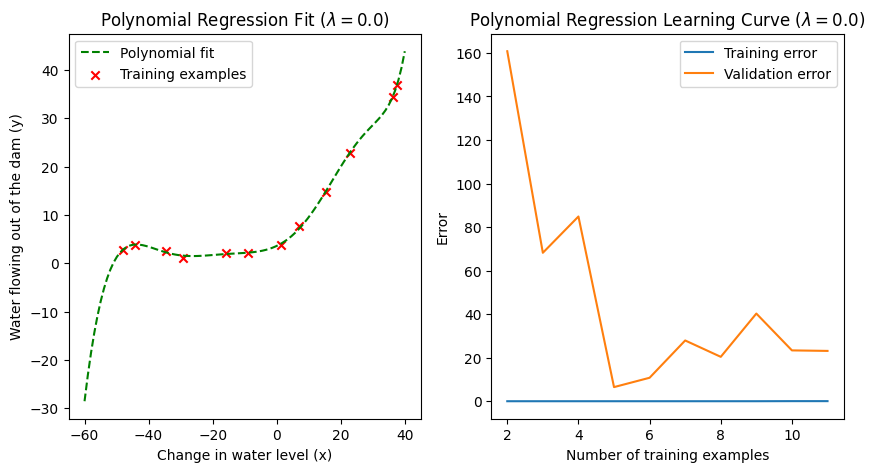
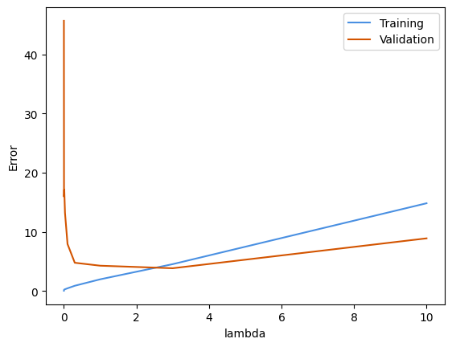
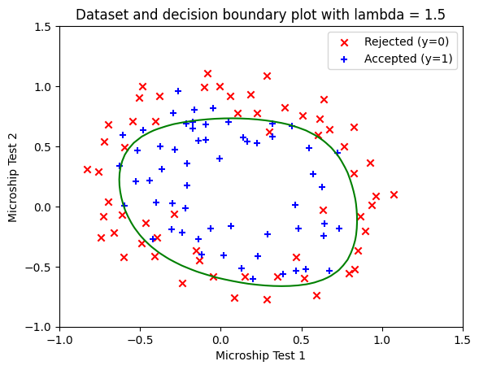

# Applied Machine Learning Experiment: Regularization, Bias-Variance, and Decision Boundaries

> Portfolio project by Dorsa Norouzi  
> © 2026 Dorsa Norouzi. All rights reserved.

## Project Overview

This repository contains applied machine learning experiments focused on regularization, model complexity, bias-variance analysis, and nonlinear decision boundaries.

The project is organized into two notebooks:

1. **Regularized Linear Regression** — studies linear regression, polynomial regression, learning curves, validation error, test error, and regularization tuning.
2. **Regularized Logistic Regression** — studies nonlinear binary classification using polynomial feature mapping and regularized logistic regression.

The goal is to present a clean portfolio version of machine learning practice work, with emphasis on implementation, evaluation, visualization, and clear documentation.

## Skills Demonstrated

- Regularized linear regression
- Regularized logistic regression
- Polynomial feature mapping
- Bias-variance analysis
- Learning curves
- Validation and test error evaluation
- Lambda / regularization tuning
- Nonlinear decision-boundary visualization
- Python, NumPy, SciPy, Matplotlib

## Result Preview

### Polynomial Regression and Learning Curve



### Regularization Parameter Analysis



### Logistic Regression Decision Boundary



## Repository Structure

```text
machine-learning-regularization-experiments/
├── README.md
├── requirements.txt
├── .gitignore
├── notebooks/
│   ├── regularized_linear_regression_experiment.ipynb
│   └── regularized_logistic_regression_experiment.ipynb
├── datasets/
│   └── README.md
└── results/
    ├── experiment_summary.md
    └── result visualizations
```

## Notebooks

### 1. Regularized Linear Regression

This notebook explores regression model behavior using a water-level dataset. It starts with a simple linear regression baseline, then applies polynomial feature expansion and regularization to study how model complexity affects training, validation, and test performance.

Key outputs include:

- Dataset visualization
- Linear regression fit
- Learning curves
- Polynomial regression fit
- Regularization validation curve
- Cross-validation learning curve

### 2. Regularized Logistic Regression

This notebook explores nonlinear binary classification using a microchip quality-assurance dataset. Polynomial feature mapping is used to transform the original two-feature input space, and regularization is used to control model complexity.

Key outputs include:

- Dataset visualization
- Polynomial feature mapping
- Regularized logistic regression cost and gradient
- Numerical optimization
- Decision-boundary plots for different regularization values

## Selected Results

- Linear regression baseline final cost: **22.37**
- Polynomial regression test error with lambda = 3: **3.57**
- Cross-validation experiment selected lambda: **0.3**
- Logistic regression initial cost: **0.693**
- Logistic regression final cost: **0.260**

## How to Run

1. Clone this repository.
2. Install the required packages:

```bash
pip install -r requirements.txt
```

3. Open the notebooks in Jupyter Notebook or VS Code.
4. Place the required dataset files in the `datasets/` folder if you want to re-run the notebooks locally.

## Dataset Note

The original dataset files are not included in this repository. The notebooks expect the following files when re-running locally:

```text
datasets/water-level-dataset.mat
datasets/microchips-dataset.csv
```

This repository focuses on the cleaned experiment notebooks, methodology, and result visualizations.

## Usage and Copyright

© 2026 Dorsa Norouzi. All rights reserved.

This repository is shared as a portfolio project for recruitment, evaluation, and learning review purposes.

No license is granted for copying, modifying, redistributing, republishing, or using this work for commercial purposes or academic submission without prior written permission from the author.
